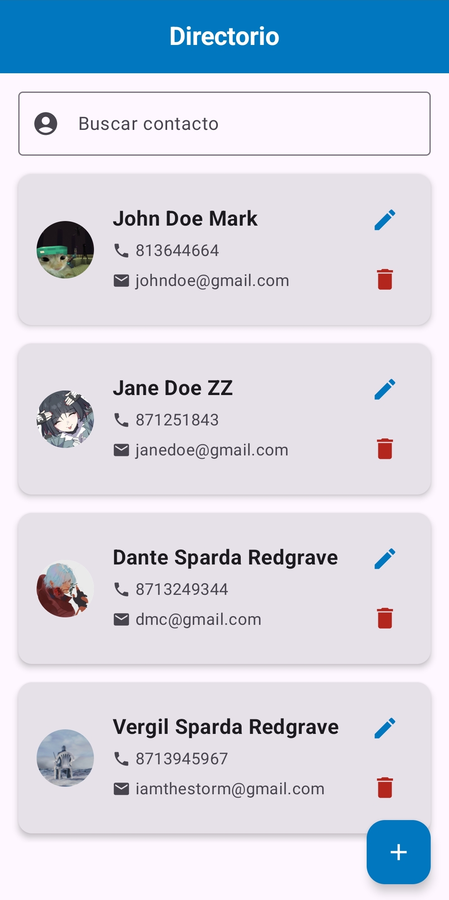
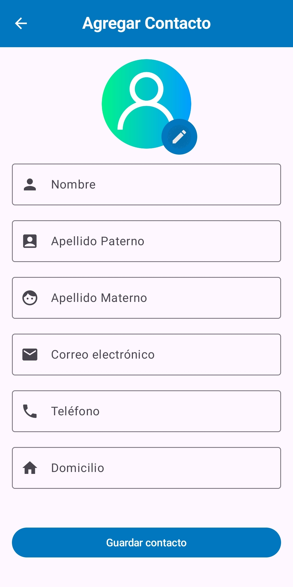
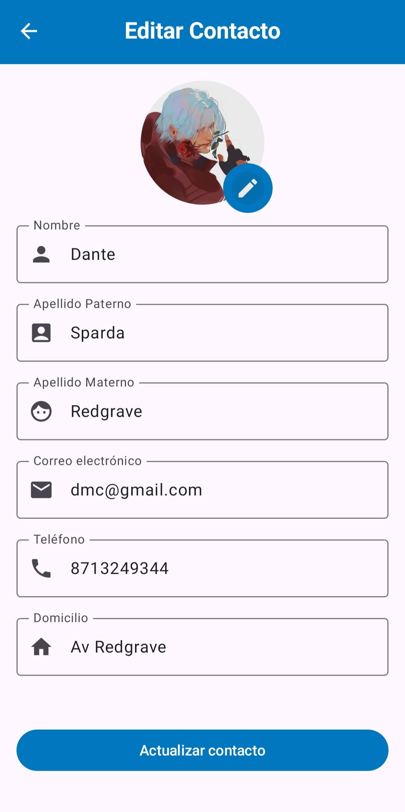
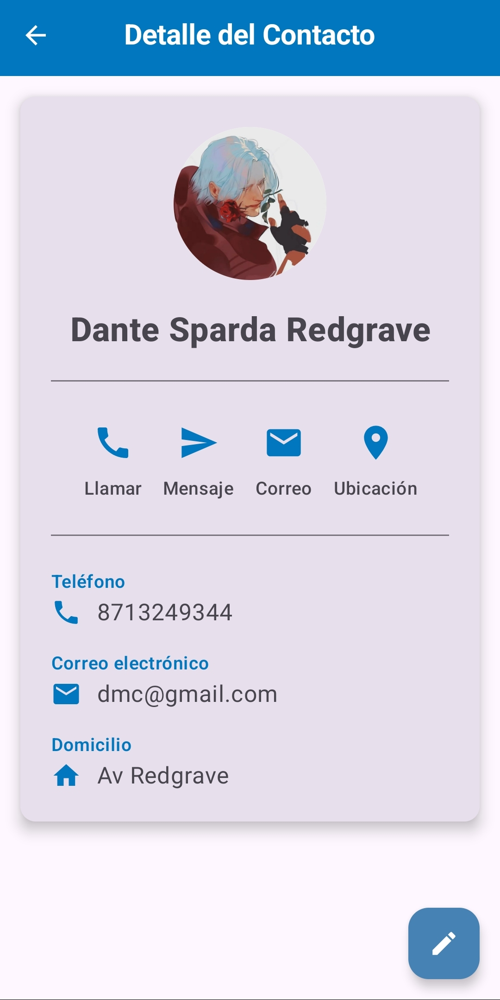

# 📇 ContactosDir

Una aplicación de contactos desarrollada con **Jetpack Compose**, diseñada para ofrecer una experiencia moderna y visualmente atractiva al gestionar tus contactos personales.

---

## 🚀 Características

- 📸 Imagen de perfil seleccionable desde la galería.
- 🧾 Agrega, edita y elimina contactos fácilmente.
- 🔍 Navegación fluida con Jetpack Navigation.
- 🎨 Interfaz moderna con Material 3 y componentes personalizados.
- 🗂️ Almacenamiento local de datos y fotos de perfil.

---

### 📋 Capturas de la aplicación

<p align="center">
  
  
</p>

<p align="center">
  
  
</p>

---

## ⚙️ Tecnologías Usadas

* [Jetpack Compose](https://developer.android.com/jetpack/compose)
* [Kotlin](https://kotlinlang.org/)
* [Material 3](https://m3.material.io/)
* [Coil](https://coil-kt.github.io/coil/) (para carga de imágenes)
* Arquitectura [MVVM](https://developer.android.com/jetpack/guide)
* Navegación con `NavController`
* Room para base de datos

---

## 🛠️ Cómo Ejecutar

1. Clona el repositorio:

   ```bash
   git clone https://github.com/tadeo-dev789/ContactosDir.git
   ```

2. Ábrelo en **Android Studio**.

3. Ejecuta el proyecto en un emulador o dispositivo físico.

---


## 👤 Autor

**Luis Enrique Tadeo Sandoval Santos**
Desarrollador Android con pasión por las interfaces limpias y la experiencia de usuario fluida.

---

## 📄 Licencia

Este proyecto está bajo la Licencia MIT. Consulta el archivo [LICENSE](LICENSE) para más información.

